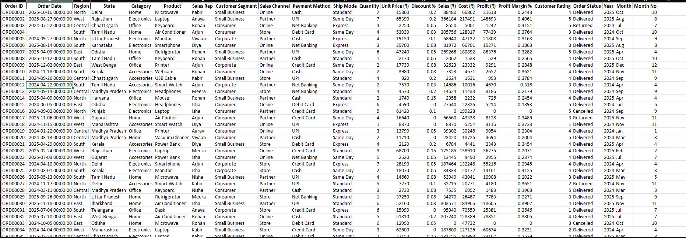
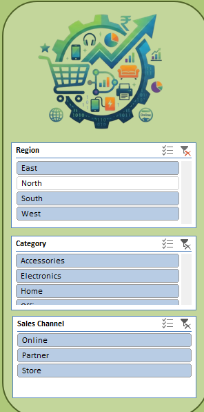
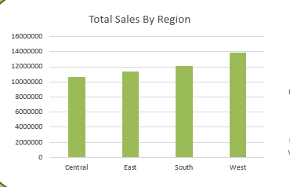
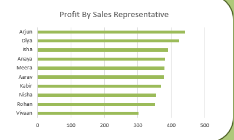
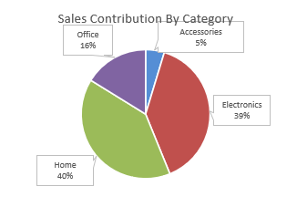
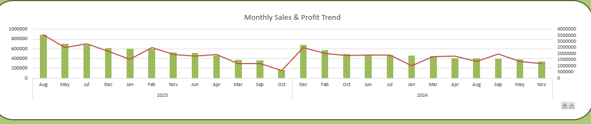
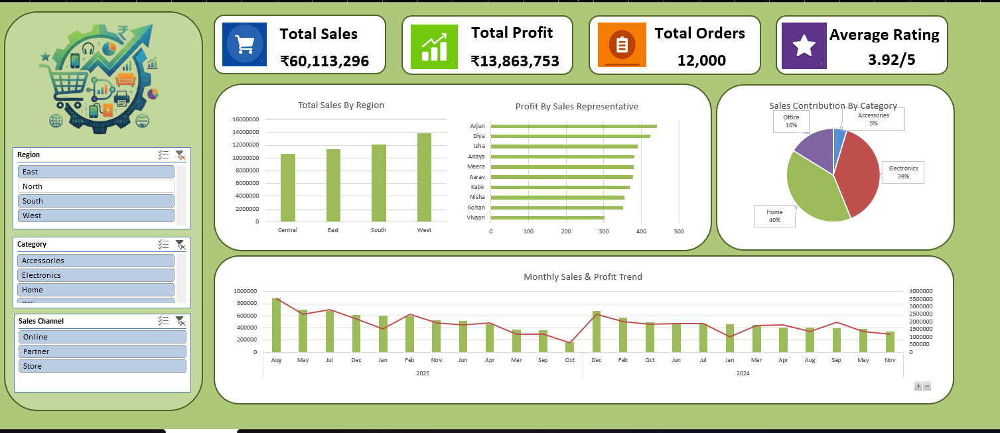

# 🛍️ Retail Sales & Business Analysis Dashboard

## 📊 Project Overview

The **Retail Sales & Business Analysis Dashboard** is an interactive Excel-based business analytics project designed to analyze retail sales performance and generate meaningful business insights from transactional data.

The project uses a structured retail sales dataset containing information about orders, customers, products, regions, sales representatives, sales channels, payment methods, shipping modes, sales, costs, profit, ratings, and order status.

The raw data was analyzed using **Microsoft Excel**, with the help of **Pivot Tables, Pivot Charts, Slicers, KPI Cards, and Dashboard Visualizations**.

The final dashboard provides a clear and interactive overview of business performance and allows users to filter the analysis using different slicers.

---

## 🎯 Project Objectives

The main objectives of this project are:

- Analyze overall sales performance.
- Track total sales and total profit.
- Monitor the total number of orders.
- Analyze average customer ratings.
- Compare sales performance across different regions.
- Analyze sales contribution by product category.
- Compare profit generated by sales representatives.
- Analyze monthly sales and profit trends.
- Compare different sales channels.
- Create an interactive and easy-to-understand Excel dashboard.
- Convert raw transactional data into useful business insights.

---

## 🛠️ Tools & Technologies Used

- **Microsoft Excel**
- Pivot Tables
- Pivot Charts
- Slicers
- KPI Cards
- Data Cleaning
- Data Analysis
- Dashboard Design
- Business Intelligence

---

# 📁 Dataset

The dataset contains retail transaction-level information used to analyze business performance.

The dataset includes **12,000 orders** and contains multiple fields related to sales, customers, products, regions, profit, ratings, and order status.

### Dataset Columns

| Column | Description |
|---|---|
| Order ID | Unique identification number of each order |
| Order Date | Date on which the order was placed |
| Region | Geographical region of the order |
| State | State associated with the order |
| Category | Product category |
| Product | Product purchased |
| Sales Rep | Sales representative responsible for the order |
| Customer Segment | Type of customer |
| Sales Channel | Channel through which the order was placed |
| Payment Method | Method used for payment |
| Ship Mode | Shipping method |
| Quantity | Number of units ordered |
| Unit Price (₹) | Price of one unit |
| Discount % | Discount applied to the order |
| Sales (₹) | Total sales/revenue generated |
| Cost (₹) | Total cost associated with the order |
| Profit (₹) | Profit generated from the order |
| Profit Margin % | Profit as a percentage of sales |
| Customer Rating | Customer/order rating |
| Order Status | Status of the order |
| Year | Year of the order |
| Month | Month of the order |
| Month No | Numerical value of the month |

---

# 📄 Sample Dataset

Below are sample records from the dataset used to create the dashboard.

| Order ID | Order Date | Region | State | Category | Product | Sales Rep | Customer Segment | Sales Channel | Payment Method | Ship Mode | Quantity | Unit Price (₹) | Discount % | Sales (₹) | Cost (₹) | Profit (₹) | Profit Margin % | Customer Rating | Order Status | Year | Month | Month No |
|---|---|---|---|---|---|---|---|---|---|---|---:|---:|---:|---:|---:|---:|---:|---:|---|---:|---|---:|
| ORD00001 | 2025-10-16 | North | Delhi | Home | Microwave | Kabir | Small Business | Online | Cash | Standard | 7 | 15800 | 0.20 | 88480 | 66862 | 21618 | 0.2443 | 4 | Delivered | 2025 | Oct | 10 |
| ORD00002 | 2025-08-27 | West | Rajasthan | Electronics | Laptop | Anaya | Small Business | Partner | UPI | Same Day | 7 | 65390 | 0.20 | 366184 | 217491 | 148693 | 0.4061 | 5 | Delivered | 2025 | Aug | 8 |
| ORD00003 | 2024-07-22 | Central | Chhattisgarh | Office | Keyboard | Rohan | Consumer | Online | Net Banking | Express | 4 | 2250 | 0.05 | 8550 | 5001 | -1242 | 0.4151 | 5 | Returned | 2024 | Jul | 7 |
| ORD00004 | — | South | Tamil Nadu | Home | Air Conditioner | Arjun | Consumer | Store | Debit Card | Same Day | 4 | 53030 | 0.03 | 205756 | 128317 | 77439 | 0.3764 | 3 | Delivered | 2024 | Oct | 10 |
| ORD00005 | 2024-09-27 | North | Uttar Pradesh | Electronics | Monitor | Vivaan | Corporate | Partner | Cash | Express | 4 | 19150 | 0.10 | 68940 | 47132 | 21808 | 0.3163 | 3 | Delivered | 2024 | Sep | 9 |
| ORD00006 | 2025-08-14 | South | Karnataka | Electronics | Smartphone | Diya | Consumer | Online | Net Banking | Express | 3 | 29700 | 0.08 | 81972 | 66701 | 15271 | 0.1863 | 3 | Delivered | 2025 | Aug | 8 |
| ORD00007 | 2025-04-09 | East | Odisha | Home | Refrigerator | Rohan | Small Business | Partner | UPI | Same Day | 6 | 47240 | 0.05 | 269268 | 180892 | 88376 | 0.3282 | 5 | Delivered | 2025 | Apr | 4 |
| ORD00008 | 2025-10-12 | South | Tamil Nadu | Office | Keyboard | Rohan | Small Business | Partner | Cash | Standard | 1 | 2170 | 0.05 | 2062 | 1533 | 529 | 0.2565 | 4 | Delivered | 2025 | Oct | 10 |
| ORD00009 | 2025-12-02 | East | West Bengal | Office | Printer | Arjun | Corporate | Online | Credit Card | Same Day | 2 | 17730 | 0.08 | 32623 | 23332 | 9291 | 0.2848 | 4 | Delivered | 2025 | Dec | 12 |
| ORD00010 | 2024-11-18 | South | Kerala | Accessories | Webcam | Rohan | Consumer | Online | Cash | Same Day | 2 | 3980 | 0.08 | 7323 | 4671 | 2652 | 0.3621 | 4 | Delivered | 2024 | Nov | 11 |
| ORD00011 | 2024-09-26 | Central | Chhattisgarh | Accessories | USB Cable | Kabir | Small Business | Store | UPI | Standard | 4 | 820 | 0.20 | 2624 | 1631 | 993 | 0.3784 | 4 | Delivered | 2024 | Sep | 9 |
| ORD00012 | 2024-04-22 | South | Tamil Nadu | Accessories | Smart Watch | Arjun | Corporate | Partner | Net Banking | Same Day | 2 | 7570 | 0.03 | 14686 | 10016 | 4670 | 0.3180 | 3 | Delivered | 2024 | Apr | 4 |
| ORD00013 | 2024-09-14 | Central | Madhya Pradesh | Electronics | Headphones | Meera | Consumer | Store | Net Banking | Standard | 4 | 4570 | 0.20 | 14624 | 11438 | 3186 | 0.2179 | 4 | Delivered | 2024 | Sep | 9 |
| ORD00014 | 2025-04-09 | North | Haryana | Office | Mouse | Rohan | Small Business | Partner | Cash | Standard | 2 | 1740 | 0.15 | 2958 | 2232 | 726 | 0.2454 | 4 | Delivered | 2025 | Apr | 4 |
| ORD00015 | 2024-06-05 | East | Odisha | Electronics | Headphones | Isha | Consumer | Online | Debit Card | Express | 6 | 4590 | 0.00 | 27540 | 22326 | 5214 | 0.1893 | 5 | Delivered | 2024 | Jun | 6 |
| ORD00016 | 2024-09-02 | North | Punjab | Electronics | Laptop | Isha | Consumer | Partner | Credit Card | Standard | 5 | 61420 | 0.10 | 0 | 199228 | 0 | 0 | 5 | Cancelled | 2024 | Sep | 9 |
| ORD00017 | 2025-11-06 | West | Gujarat | Home | Air Purifier | Arjun | Consumer | Partner | Credit Card | Same Day | 4 | 16640 | 0.00 | 66560 | 43338 | -8128 | 0.3489 | 3 | Returned | 2025 | Nov | 11 |
| ORD00018 | 2024-11-15 | West | Maharashtra | Accessories | Smart Watch | Diya | Consumer | Online | UPI | Express | 1 | 8370 | 0.00 | 8370 | 5254 | 3116 | 0.3723 | 1 | Delivered | 2024 | Nov | 11 |

> **Note:** The table above shows sample records from the dataset. The complete dataset contains additional transaction records used for the dashboard analysis.



---

# 🎛️ Dashboard Filters / Slicers

The dashboard contains three interactive slicers that allow users to filter the analysis dynamically.

### 1. Region

The Region slicer contains:

- East
- North
- South
- West

### 2. Category

The Category slicer contains:

- Accessories
- Electronics
- Home
- Office

### 3. Sales Channel

The Sales Channel slicer contains:

- Online
- Partner
- Store

These slicers make the dashboard interactive and allow users to analyze specific regions, categories, and sales channels.

## Screenshot



---

# 📊 KPI Cards

The dashboard contains four major Key Performance Indicators (KPIs).

### 💰 Total Sales

**₹60,113,296**

This KPI represents the total sales/revenue generated from the analyzed orders.

### 📈 Total Profit

**₹13,863,753**

This KPI represents the total profit generated from the business transactions.

### 🧾 Total Orders

**12,000**

This KPI represents the total number of orders included in the dashboard analysis.

### ⭐ Average Rating

**3.92 / 5**

This KPI represents the average customer rating.

## Screenshot


---

# 🌍 Total Sales by Region

This chart compares the total sales generated across different geographical regions.

### Regions Analyzed

- Central
- East
- South
- West

The visualization helps identify differences in sales performance between regions and determine which regions contribute more to overall sales.

### Chart Type

**Column Chart**

## Screenshot



---

# 👤 Profit by Sales Representative

This chart analyzes the profit generated by different sales representatives.

### Sales Representatives Analyzed

- Arjun
- Diya
- Isha
- Anaya
- Meera
- Aarav
- Kabir
- Nisha
- Rohan
- Vivaan

The visualization helps compare sales representative performance based on profit contribution.

### Chart Type

**Horizontal Bar Chart**

## Screenshot



---

# 🛒 Sales Contribution by Category

This visualization shows the contribution of different product categories to overall sales.

### Categories Analyzed

- Accessories
- Electronics
- Home
- Office

The chart helps understand the relative contribution of each product category and identify categories with higher sales contribution.

### Chart Type

**Pie Chart**

## Screenshot



---

# 📅 Monthly Sales & Profit Trend

This visualization analyzes sales and profit performance across different months and years.

The chart helps identify:

- Monthly sales patterns
- Monthly profit patterns
- High-performing periods
- Low-performing periods
- Changes in sales performance over time

### Chart Type

**Combination Chart**

The chart uses columns for sales and a line to represent profit, making it easier to compare the two metrics.

## Screenshot



---

# 📈 Dashboard Overview

The final dashboard brings together the major KPIs, charts, and interactive slicers into a single visual interface.

The dashboard provides a quick summary of:

- Total Sales
- Total Profit
- Total Orders
- Average Rating
- Regional Sales
- Sales Representative Profit
- Category Sales Contribution
- Monthly Sales & Profit Trends

## Screenshot



---

# 🔍 Business Questions Answered

The dashboard can be used to answer several important business questions:

1. What is the total sales generated by the business?
2. What is the total profit generated?
3. How many total orders are there?
4. What is the average customer rating?
5. Which region generates the highest sales?
6. Which sales representative contributes the most profit?
7. Which product category contributes the most to sales?
8. How do sales and profit change month by month?
9. How does performance change across different sales channels?
10. How does regional performance change when different categories are selected?
11. How does the dashboard performance change when different slicer combinations are applied?

---

# 💡 Key Business Insights

The dashboard helps in understanding business performance from different perspectives.

### Sales Performance
Total sales provide an overview of the overall revenue generated by the business.

### Profitability
Total profit and profit by sales representative help identify profitable areas of the business.

### Regional Performance
Regional sales comparison helps determine which geographical areas are performing strongly.

### Category Performance
Category-wise sales contribution helps identify products and categories that generate a larger share of sales.

### Monthly Trends
Monthly sales and profit trends help identify changes in performance over time.

### Customer Experience
Average customer rating provides an indication of customer satisfaction.

### Interactive Analysis
Slicers allow users to dynamically filter the dashboard and analyze specific segments of the business.

---

# 🔄 Data Analysis Workflow

The project follows a simple data analysis workflow:

```text
Raw Dataset
     ↓
Data Cleaning & Preparation
     ↓
Pivot Tables
     ↓
Pivot Charts
     ↓
Slicers
     ↓
KPI Cards
     ↓
Interactive Dashboard
     ↓
Business Insights
